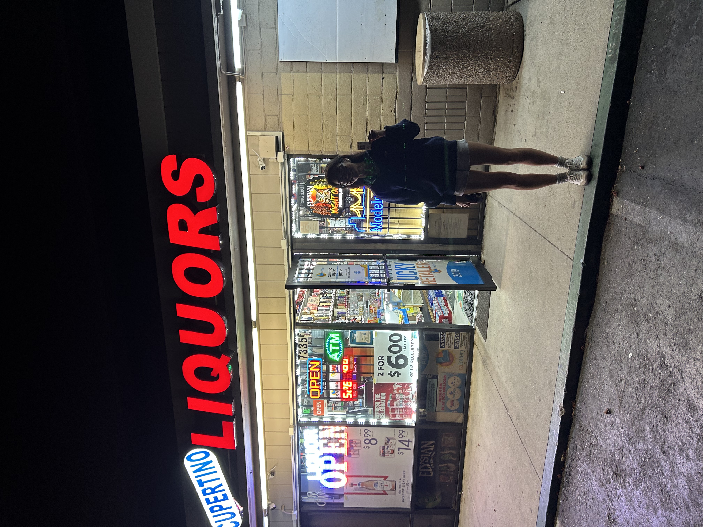
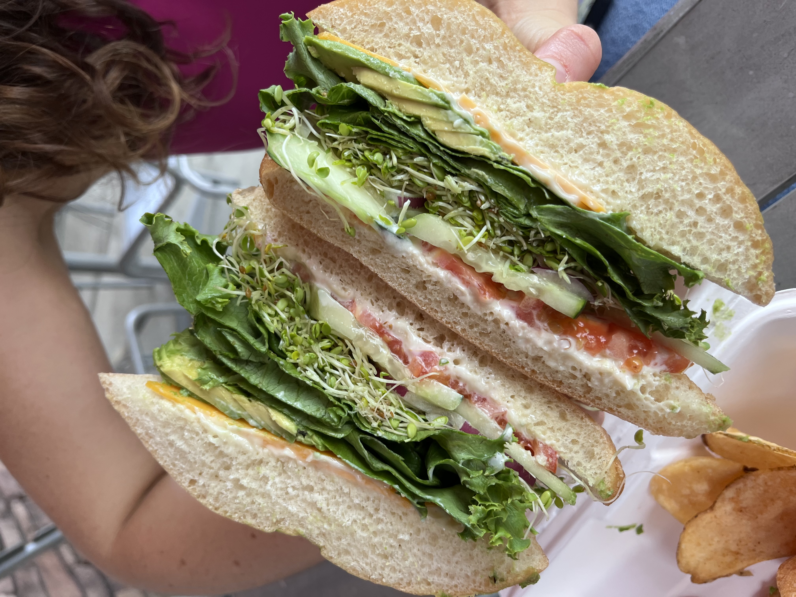
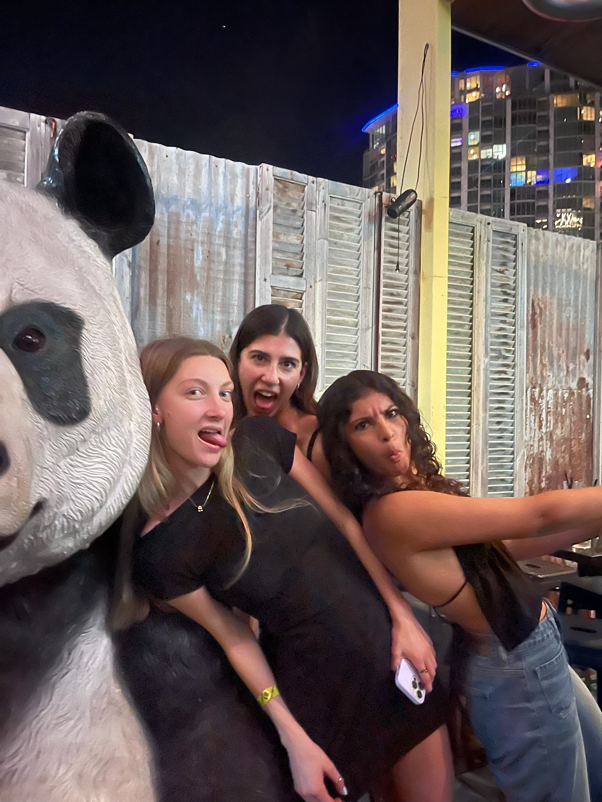
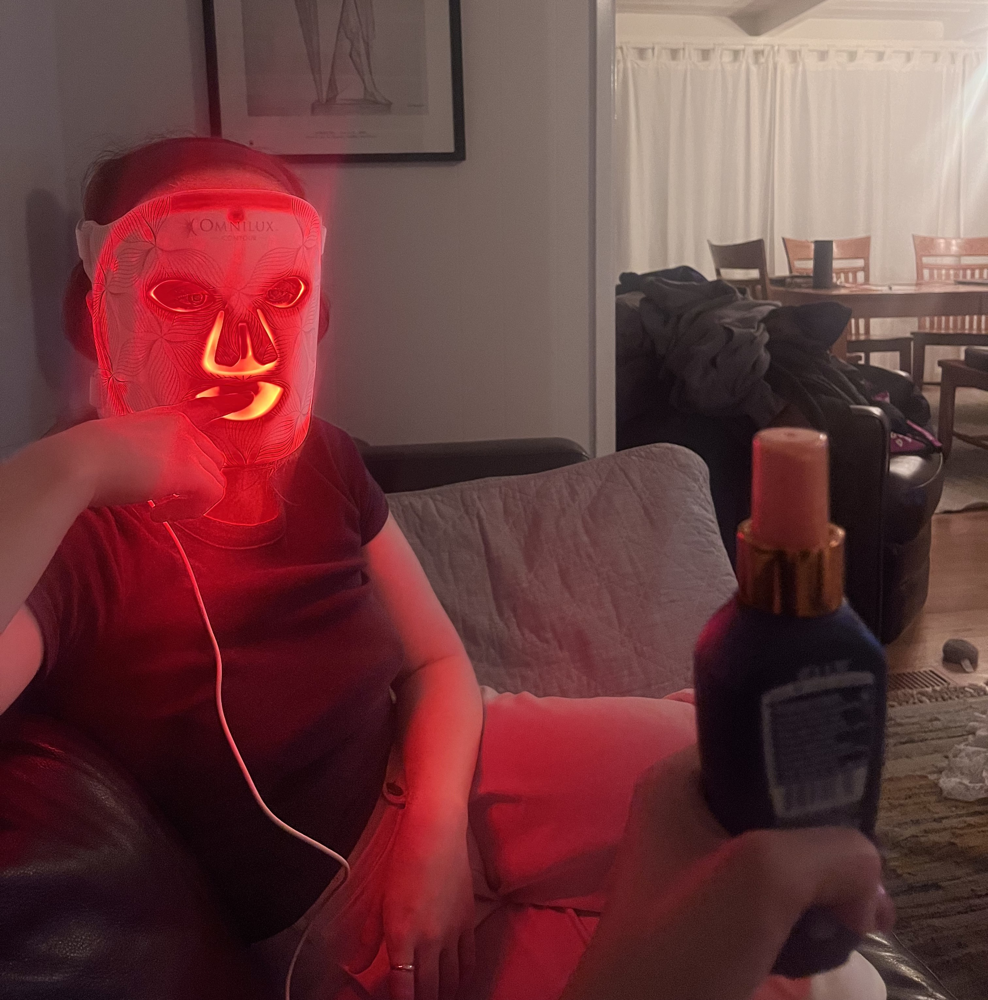
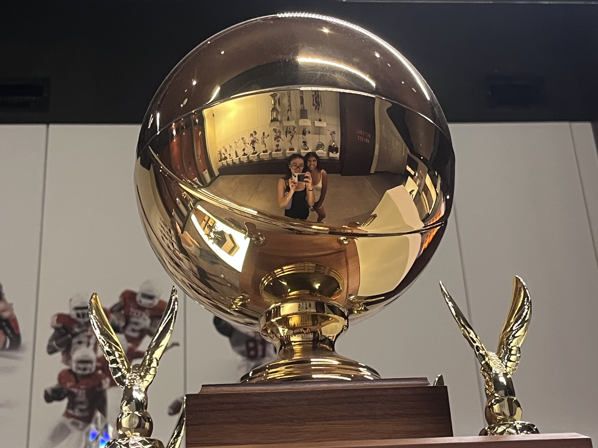
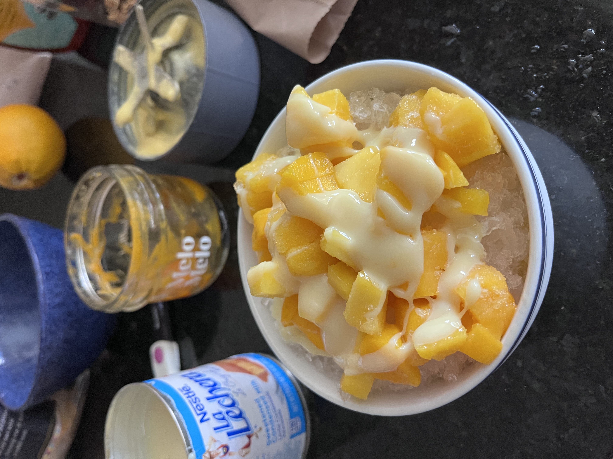
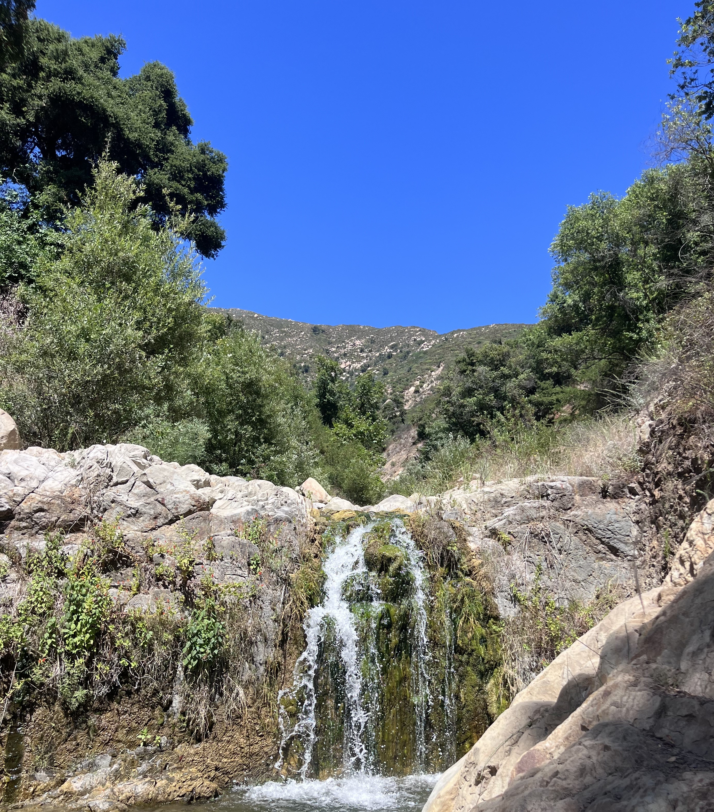
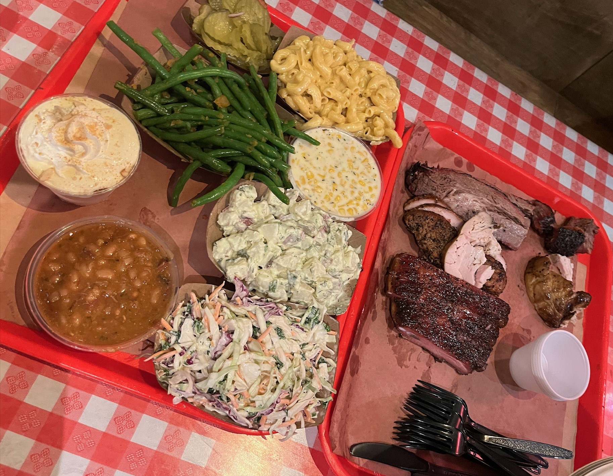

> ## babbling
> */bab(ə)liNG/*
>
> *adjective*
> 
> 1. talking rapidly and continuously in a foolish, excited, or incomprehensible way.  
>    *"the noise of babbling tourists"*
> 
> 2. (of flowing water) making a continuous murmuring sound.  
>    *"a gently babbling brook"*

 

Hello world! I'm Brook and per my blog's name welcome to my inner ramblings.  
Topics include but are not limited to pop culture, books, math, trading, ect.   
Proceed with caution and thanks for visiting! 
 
[Last update: October 2025] 

## Fresh Off the Press!

## [{{ latest_post.title }}]({{ latest_post.url }})  
*Published on {{ latest_post.date | date: "%B %d, %Y" }}*

<!---Images-->
<figure style="display: flex; flex-direction: column; align-items: center;">
  
  <figcaption>Walton Ford, Cabeza de Vaca, 2021</figcaption>
</figure>

## Currents 
*Great British Bake Off:*
Soggy bottom. Stodgy. Style over substance. All phrases I could describe myself with at this given moment in time. There's a certain camaraderie when you watch a bunch of underdogs thrown into a stuffy tent crashing out over their crème pât that makes it both entertaining to watch and a commentary on the aubsurdism of life.

*Aggressively Making Birthday Cards:* 
A couple weeks ago I was convinced I was the next Martha Stewart in the making and my crafting empire was on the come up. Um...safe to say I got bored after the first two cards and ditched the effort. 

*Fingerless Gloves:*
As a house warming present last year our apartment kitchen sink decided it had enough and burst all the backed up contents of the sink disposal (of multiple apartments) onto our kitchen floor (twice). Now, the AC has decided that the LA sunshine is not for her and has made the apartment an icy tundra fit for hell. To type on my computer to get anything done consists of me wearing fingerless gloves. We need a rent discount. 

<h2>Book Tracker</h2>

  

    <h3 style="margin-bottom: 4px; font-size: 1.1em;">Total Books Read</h3>
    
📚 745

  

  

    <h3 style="margin-bottom: 4px; font-size: 1.1em;">Books Read in 2025</h3>
    
📅 20

  

  

    <h3 style="margin-bottom: 4px; font-size: 1.1em;">Want to Read</h3>
    
"The Stranger" by Albert Camus

  

<!-- Full-width Progress Bar -->

  <h4 style="margin-bottom: 6px;">2025 Reading Goal Progress</h4>
  

    

      

    

    
20 of 50 books read

  

<!---Images-->
<figure style="display: flex; flex-direction: column; align-items: center;">
  
  <figcaption>Walton Ford, Chay, 2021</figcaption>
</figure>

## Life at a Glimpse
<!-- First set of 3 images -->

  

    
    
In adherence to the National Minimum Drinking Age Act of 1984

  

  

    
    
A very scrummy veggie sammy

  

  

    
    
When spring break plans make it out of the group chat 

  

<!-- Second set of 3 images (page break) -->

  

    
    
Linnea and her lizard shed (red light therapy)

  

  

    
    
Stained glass in National Palace of Pena

  

  

    
    
One very shiny trophy located in Longhorn Athletics Hall 

  

<!-- Third set of 3 images (page break) -->

  

    
    
Homemade mango bingsu

  

  

    
    
Hike at Gould Park in Santa Barbara

  

  

    
    
Terry Black's: It's sacrilege how good this was

  

  

