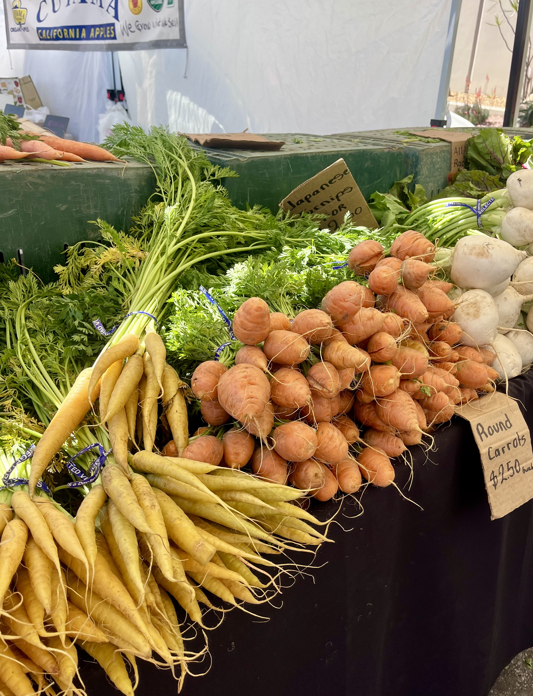
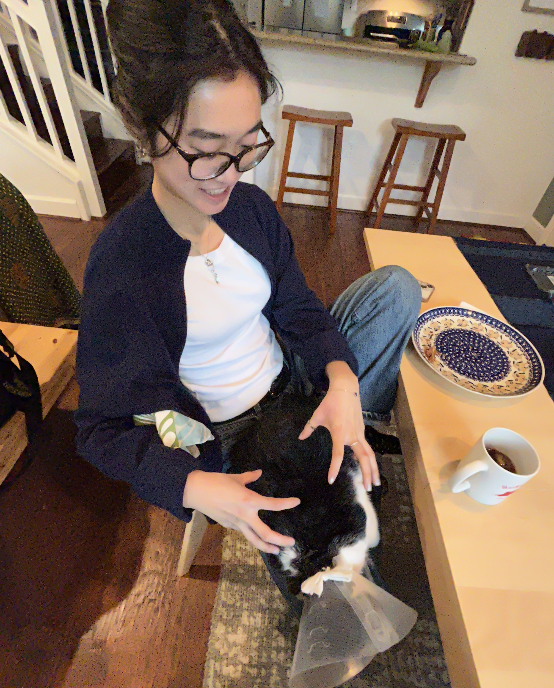

> ## babbling
> */bab(ə)liNG/*
>
> *adjective*
> 
> 1. talking rapidly and continuously in a foolish, excited, or incomprehensible way.  
>    *"the noise of babbling tourists"*
> 
> 2. (of flowing water) making a continuous murmuring sound.  
>    *"a gently babbling brook"*

 

Hello world! I'm Brook and per my blog's name welcome to my inner ramblings.  
Topics include but are not limited to pop culture, books, math, trading, ect.   
Proceed with caution and thanks for visiting!  

## Fresh Off the Press!

## [{{ latest_post.title }}]({{ latest_post.url }})  
*Published on {{ latest_post.date | date: "%B %d, %Y" }}*

## Currents 
*Jersey Mike's Jersey Shore Favorite:*
I don't know if they imbued this sandwich with crack but it was the most scrum-dilly-uptious thing I have ever had the pleasure of consuming. No notes. I went to Trader Joe's the next day to make a poor mans version.

*Game of Thrones:* 
My roommates and I finished all 8 seasons in approximately 2 months. This show was... absolutely insane; Rosh and I were GAGGED when we watched Baelor and the Red Wedding and I fear I lost my mind when Ed Sheeran came on screen. I also can't stop saying "Brienne of Tarth!" and am still salty about Lord Varys' character arc. 

*Emma, Jane Austen:*
“I cannot make speeches, Emma...If I loved you less, I might be able to talk about it more. But you know what I am. You hear nothing but truth from me. I have blamed you, and lectured you, and you have borne it as no other woman in England would have borne it.” I mean... what more do I need to say. 

<h2>Book Tracker</h2>

  

    <h3 style="margin-bottom: 4px; font-size: 1.1em;">Total Books Read</h3>
    
📚 742

  

  

    <h3 style="margin-bottom: 4px; font-size: 1.1em;">Books Read in 2025</h3>
    
📅 14

  

  

    <h3 style="margin-bottom: 4px; font-size: 1.1em;">Want to Read</h3>
    
"These Old Shades" by Georgette Heyer

  

<!-- Full-width Progress Bar -->

  <h4 style="margin-bottom: 6px;">2025 Reading Goal Progress</h4>
  

    

      

    

    
14 of 50 books read

  

## Life at a Glimpse
<!-- First set of 3 images -->

  

    
    
When in Austin (bad decisions are made)

  

  

    
    
Rotund carrots spotted at Brentwood Farmers Market

  

  

    
    
When spring break plans make it out of the group chat 

  

<!-- Second set of 3 images (page break) -->

  

    
    
Linnea and her lizard shed (red light therapy)

  

  

    
    
Stained glass in National Palace of Pena

  

  

    
    
One very shiny trophy located in Longhorn Athletics Hall 

  

<!-- Third set of 3 images (page break) -->

  

    
    
Hike at Gould Park in Santa Barbara

  

  

    
    
Oskar the demon tuxedo cat

  

  

    
    
Terry Black's: It's sacrilege how good this was

  

  

