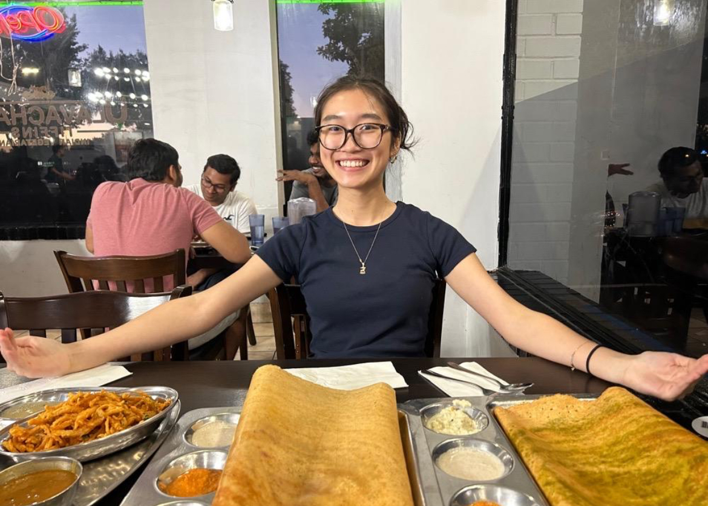

 ### babbling
> */bab(ə)liNG/*
>
> *adjective*
> 
> 1. talking rapidly and continuously in a foolish, excited, or incomprehensible way.  
>    *"the noise of babbling tourists"*
> 
> 2. (of flowing water) making a continuous murmuring sound.  
>    *"a gently babbling brook"*

 

Hello world! I'm Brook and per my blog's name welcome to my inner ramblings.  
 
I write about anything I've been reading, learning in stats, math, trading, ect.  
Warning: This blog serves as a personal notebook -- full of half-assed ideas, vibe code, and questionable logic.    
Proceed with caution and thanks for visiting!  

 

<!-- First set of 3 images -->

  

    
    
When in Austin (bad decisions are made)

  

  

    
    
Rotund carrots spotted at the Brentwood Farmers Market

  

  

    
    
When spring break plans make it out of the group chat 

  

<!-- Second set of 3 images (page break) -->

  

    
    
One very shiny trophy located in the Longhorn Athletics Hall 

  

  

    
    
Terry Black's: It's sacrilege how good this was

  

  

    
    
The spread with (not pictured) Linnea at UlavacharU Tiffins

  

 

